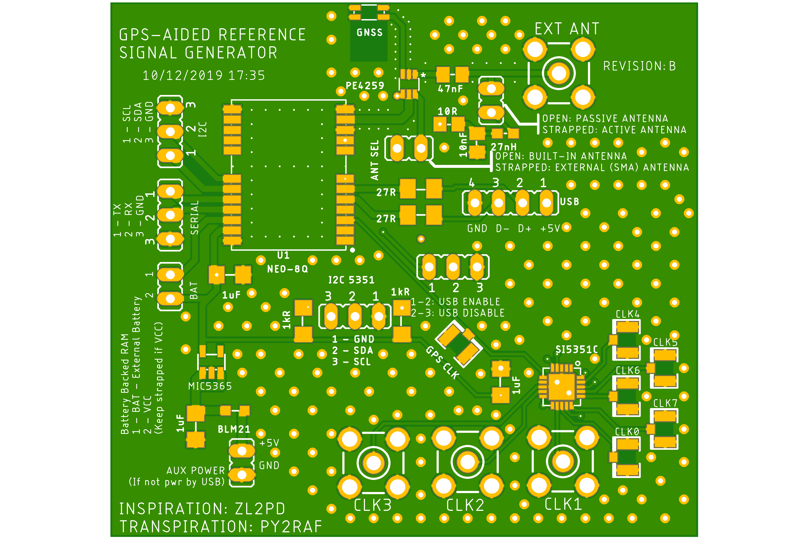

# GPS-Referenced Programmable Precision Signal Generator

**Current state:** Project Stage. [Issues](https://github.com/rfrht/gps-reference/issues?q=is%3Aissue+is%3Aclosed)

**Next steps:** Procure, build, assemble, test.

## Overview

This is the do-it-yourself version of the u-Blox-based **GPS-Referenced Programmable Precision Signal Generator**.

In this version/revision, there's a Si5351-C clock generator driven by the GPS signal, hoping to be able to get more and cleaner signals using the GPS as a reference. See the [schematic](/gps-schematics.pdf).

There are two I²C ports - one from the the U-Blox and other for the Si5351C device. The clock signal level is TTL 3.3V.

The board was inspired by [ZL2PD design](https://www.zl2pd.com/GPS_Freq_Ref.html) and features a few other stuff, like break-out headers for I2C, Serial, USB, External Battery and antenna selector.

RA3APW [did some some extensive research (Russian content)](http://www.ra3apw.ru/proekty/ublox-neo-7m/) and found that there are a few frequencies where there is some very good precision for the general hobbyist, yielding precision between 0.1 PPM to 1 PPB. This is not a [GPS-Disciplined Oscillator](https://en.wikipedia.org/wiki/GPS_disciplined_oscillator) but a high precision [Numerically Controlled Oscillator](https://en.wikipedia.org/wiki/Numerically_controlled_oscillator) instead.

Bear in mind that the RA3APW tested U-Blox M-7 hardware, while in this project we will be using the newer generation [NEO-M8Q-01A Automotive grade](https://www.u-blox.com/en/product/neo-m8q-01a-module), which sports a [TCXO](https://en.wikipedia.org/wiki/Crystal_oscillator#Temperature), (hopefully) increasing precision.

## Configuration
Use the [U-Blox U-Center](https://www.u-blox.com/en/product/u-center) tool to configure your board. Open the Config page, in `TP5 (Timepulse 5)` menu and configure as per the below screenshot:

*U-Blox Configuration page - Click to enlarge*

### To do: document the 5351C setup

## Artefacts

The [schematics](/Schematics) are in Autodesk Eagle CAD format.

There is a [Gerber](/Design/gps-gerbers.zip) for ordering a PCB from your favourite PCB shop (Hint: $2 in jlcpcb.com for 5 units), as well a Digi-Key friendly [Bill of Materials](/Design/gps-bom.csv).

## Board pictures:
Board: (**Revision A, not this one**)

Cabled (with external wire antenna):

## TODO:
Check [Issues](https://github.com/rfrht/gps-reference/issues)
